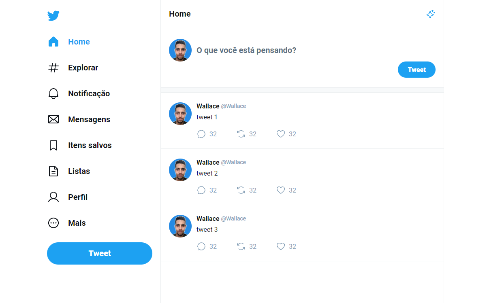

<h1 align="center"> Twitter Ui Clone - Masterclass React  </h1>

Esse é um projeto prático feito na Masterclass React da RocketSeat.

 

  

## 💻 Projeto

Esse projeto é um clone da interface de usuário (UI) do Twitter utilizando React focado em abordar os fundamentos dessa tecnologia como componentização, propriedades, estado, formulários, etc.

## 🚀 Tecnologias

Esse projeto foi desenvolvido com as seguintes tecnologias:

- HTML e CSS
- [React](https://reactjs.org/)
- [Sass](https://sass-lang.com/)
- [Vite](https://vitejs.dev/)

---

Feito com ♥ by Wallace Bezerra

  

